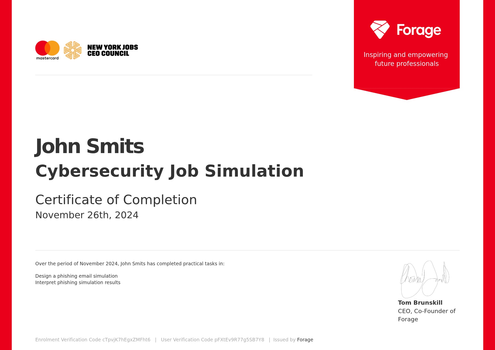

# [Pentesting Report](https://docs.google.com/presentation/d/1M5L3_onvIxR1TGRbbQt7N6IqurCT8slYpj4XAKZYRH8/edit?usp=sharing)

The link to the google presentaion above is on the Metasploit Framework, demonstrating how attackers use reverse shell techniques and Meterpreter payloads to gain remote access to compromised systems. Explained how malicious payloads are generated and delivered through social engineering vectors (e.g., email attachments or links), and how Meterpreter enables post-exploitation activities such as privilege escalation, file access, and system control. Emphasized defensive strategies, including detection methods, endpoint protection, and user awareness to mitigate these threats.

The image below shows the certification for the phishing email and cyber awareness training on forager with mastercard.
 

