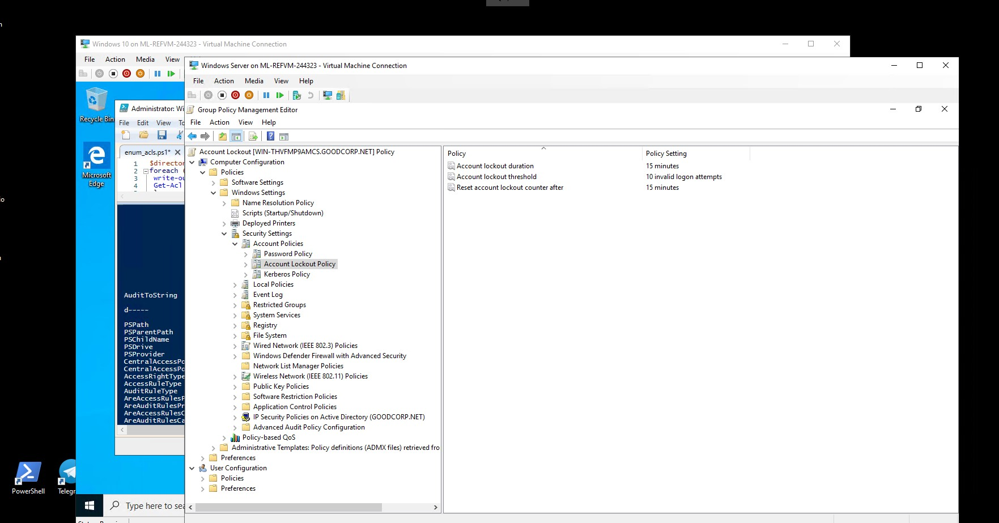
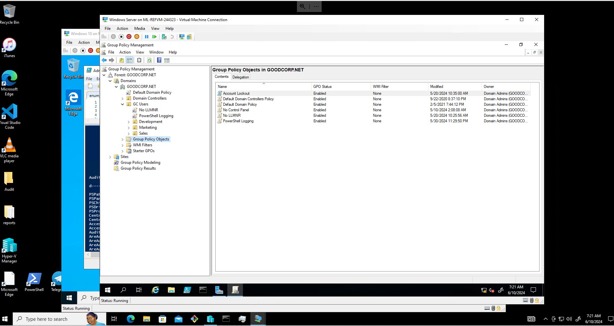
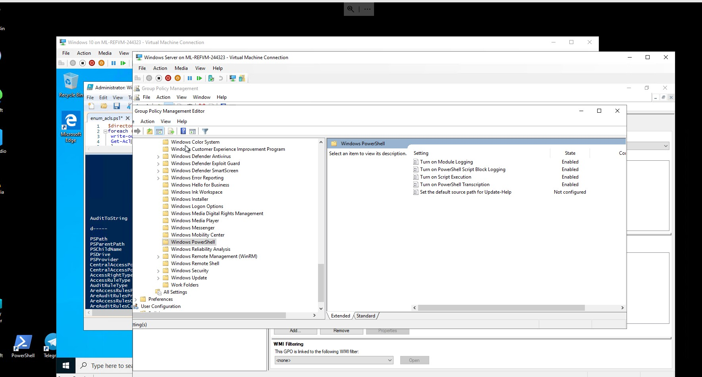
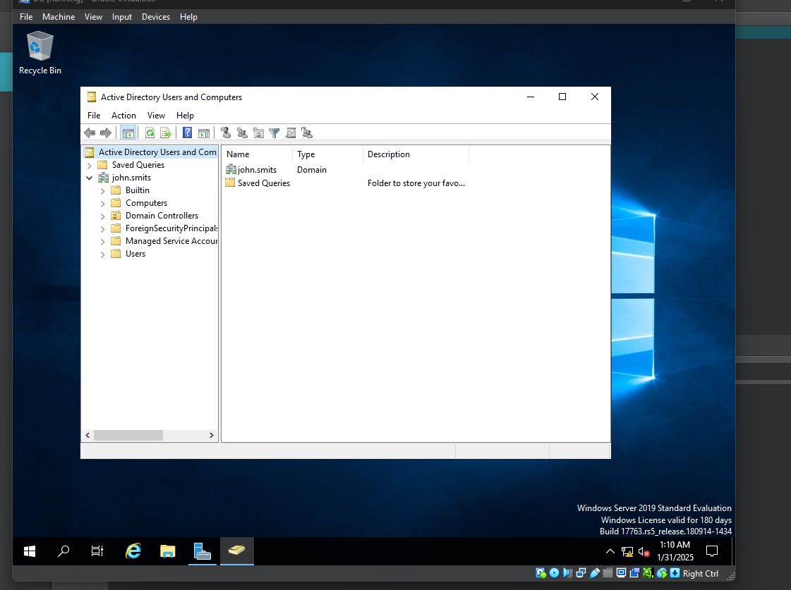
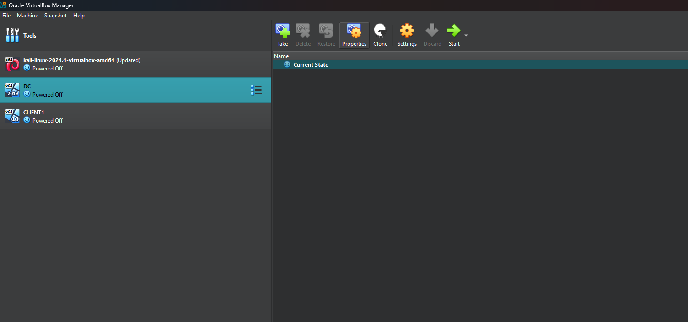
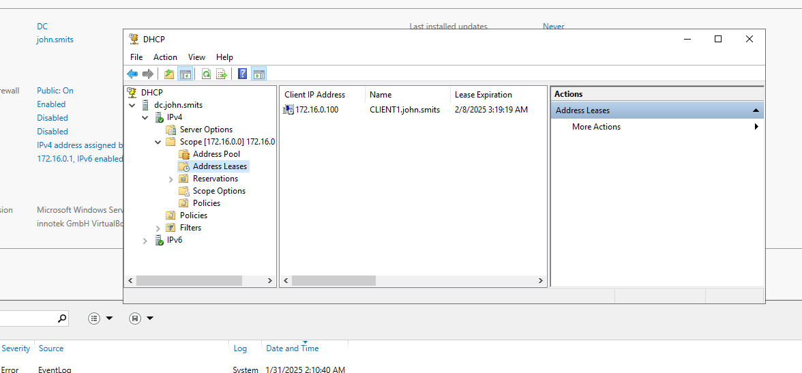
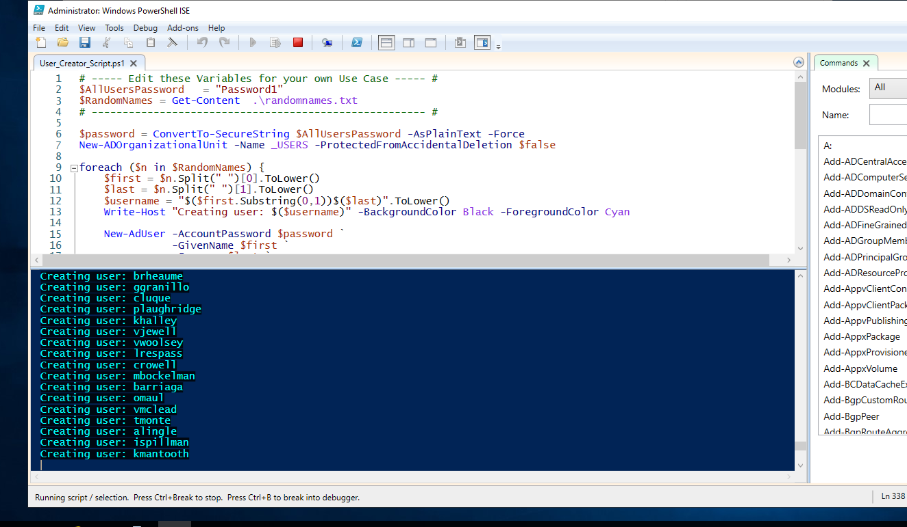

#Windows AD lab (2 labs)

#Lab 1

One lab was done on Azure cloud and I was tasked with creating GPOs to enforce different
policies that might be used in a company environment. I also created a script to list the ACLs
of all items in a directory.

#lab 2

For this lab I used virtual box and installed windows server 2019 for the DC and Windows 10 
for the client. I wanted the clients to be able to connnect to the internet but at the same time I
wanted to give them private IP's from the DC so they can commicate with each other. There are 2 
Virtual Network Interface Card's(NIC) I used for the DC. The NAT to communicate with the internet 
through my host PC, and the internal network. The DC acted as the default gateway for all the 
Clients so they could connect to the internet. I had to install windows AD on the DC and then
DHCP so it could automatically assign the clients IP addresses.

I also used this script to create 1000 users to play with.

